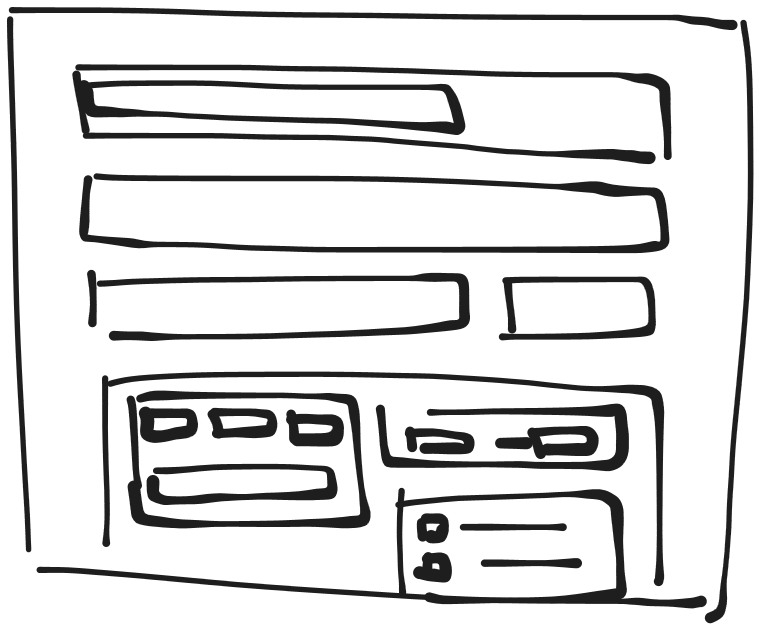

# Downloading a video
This assumes that you want to use the yt-dlp defaults, essentially calling 

``yt-dlp 'url'``

- a field for a url
- the download button
- an output file location
- a loading screen

## Changing options

I would want to run a silent run, the options would load, then fill up with possible options

1. quality section
    - fields for possible formats
    - and fields for conversion required formats (ffmpeg)
    - adenoidal fields for video quality separate
    - and audio quality separate
2. playlist section
    - a field for start and end of a section
3. parts downloader section
    - this would have an on off switch
    - then a start and end
4. a custom file name builder
    - with the possible data as buttons
    - trim on off field
5. thumbnail and info section
    - on off subtitles
    - on off embedd thumbnail 
    - on off embed metadata 
6. cookies section
    - cookies from browser option, auto check current browser
7. free section, to add commands

## Save profiles

a way to save and load options profiles, these should be held in localstorage, instead of a database because I don't want to run a database

## OTHER THIGNS

1. I want a big ass progress bar at the top because progress bars are cool, also would serve as a notification bar
2. I want to be able to check if they have yt-dlp and ffmpeg installed
3. I want to be able to autopopulate the options bar dropdowns

